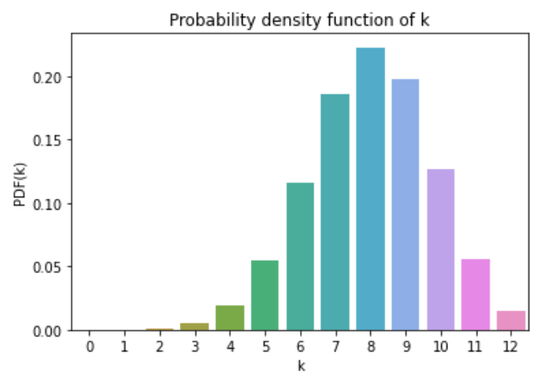

This repository contains the code of a Python package that implements [Gaussian](https://en.wikipedia.org/wiki/Normal_distribution) and [Binomial](https://en.wikipedia.org/wiki/Binomial_distribution) distributions.

## Download

#### Dependencies

This package requires:

- Python (>= 3.7.4)
- seaborn (>=0.11.1)
- matplotlib.pyplot (>=3.3.3)
- numpy (>=1.19.5)

#### Installation

To install the package use pip as follows:

`$ pip3 install shay-dists`


## How to use  

```python
from distributions import Gaussian, Binomial
```

#### Making a Gaussian instance
  

The constructor receives the mean and standard deviation:

```python
gaussian = Gaussian(25, 6)
```

#### Making a Binomial instance
  

The constructor receives the probability of an event ocurring and the size of the distribution:

```python
binomial = Binomial(0.7, 10)
```


#### Adding two distributions

Due to Python magic methods, it's possible to sum two Gaussians and it outputs a new Gaussian class with the updated mean and standard deviation. The same applies to Binomial class.

```python
gaussian_one = Gaussian(10, 3)
gaussian_two = Gaussian(32, 7)

gaussian_one + gaussian_two
```

#### Reading data from a file

You can load data from a .txt file using the method `read_data_file()` in both classes: 

```python
gaussian = Gaussian()
gaussian.read_data_file('numbers.txt')
```

And calculate the mean and standard deviation from the data using the methods `calculate_mean()` and `calculate_stdev()`, respectively.

In the Binomial class, to update the probability of an event ocurring from the dataset, use the method `replace_stats_with_data()`.

#### Plotting histogram

For the Gaussian class use the method `plot_histogram()` and for the Binomial classe use `plot_bar()`.


#### Probability density function

In the Binomial class, you can calculate the probability of `k` positive events ocurring in a sample of size `n` using the method `pdf(k)`.

<div style="text-align:center" height=></div>


